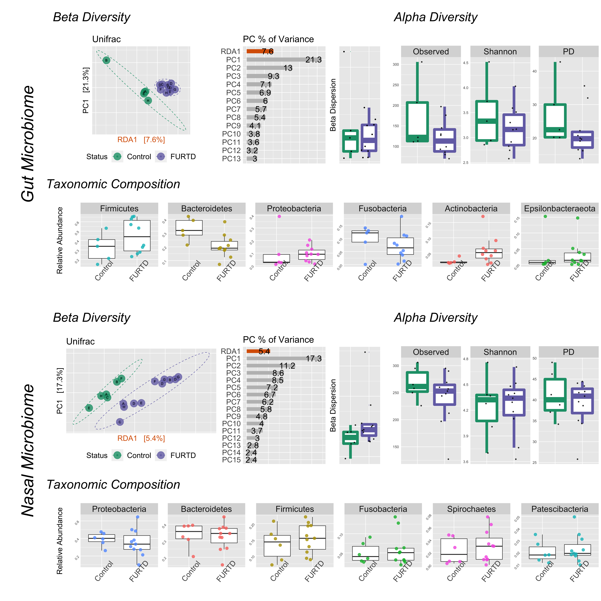

README
================
Holly Arnold
9/21/2022

## Chronic clinical signs of upper respiratory tract disease associate with gut and respiratory microbiomes in a cohort of domestic felines

Feline upper respiratory tract disease (FURTD), often caused by
infections etiologies, is a multifactorial syndrome affecting feline
populations worldwide. Because of its highly transmissible nature,
infectious FURTD is most prevalent anywhere cats are housed in groups
such as animal shelters, and is associated with negative consequences
such as decreasing adoption rates, intensifying care costs, and
increasing euthanasia rates. Understanding the etiology and
pathophysiology of FURTD is thus essential to best mitigate the negative
consequences of this disease. Clinical signs of FURTD include acute
respiratory disease, with a small fraction of cats developing chronic
sequelae. It is thought that nasal mucosal microbiome changes play an
active role in the development of acute clinical signs, but it remains
unknown if the microbiome may play a role in the development and
progression of chronic clinical disease. To address the knowledge gap
surrounding how microbiomes link to chronic FURTD, we asked if microbial
community structure of upper respiratory and gut microbiomes differed
between cats with chronic FURTD signs and clinically normal cats. We
selected 8 households with at least one cat exhibiting chronic clinical
FURTD, and simultaneously collected samples from cohabitating clinically
normal cats. Microbial community structure was assessed via 16S rDNA
sequencing of both gut and nasal microbiome communities. Using a
previously described ecophylogenetic method, we identified 37 and 27
microbial lineages within gut and nasal microbiomes respectively that
significantly associated with presence of active FURTD clinical signs in
cats with a history of chronic signs. Overall, we find that nasal and
gut microbial communities may contribute to the development of chronic
clinical course, but more research is needed to confirm our
observations.

<div class="figure" style="text-align: center">


<p class="caption">
your caption
</p>

</div>

## R Markdown

This is an R Markdown document. Markdown is a simple formatting syntax
for authoring HTML, PDF, and MS Word documents. For more details on
using R Markdown see <http://rmarkdown.rstudio.com>.

When you click the **Knit** button a document will be generated that
includes both content as well as the output of any embedded R code
chunks within the document. You can embed an R code chunk like this:

``` r
getwd()
```

    ## [1] "/Users/arnoldhk/Desktop/Research/2019CatMicrobiomes/FURTD_PLoS_Submission_Package_Reviewer_Comments/FURTD_gitlab/domestic_feline_cohort_gut_nasal_microbiomes_analyses"

``` r
summary(cars)
```

    ##      speed           dist       
    ##  Min.   : 4.0   Min.   :  2.00  
    ##  1st Qu.:12.0   1st Qu.: 26.00  
    ##  Median :15.0   Median : 36.00  
    ##  Mean   :15.4   Mean   : 42.98  
    ##  3rd Qu.:19.0   3rd Qu.: 56.00  
    ##  Max.   :25.0   Max.   :120.00

## Including Plots

You can also embed plots, for example:

<!-- -->

Note that the `echo = FALSE` parameter was added to the code chunk to
prevent printing of the R code that generated the plot.
