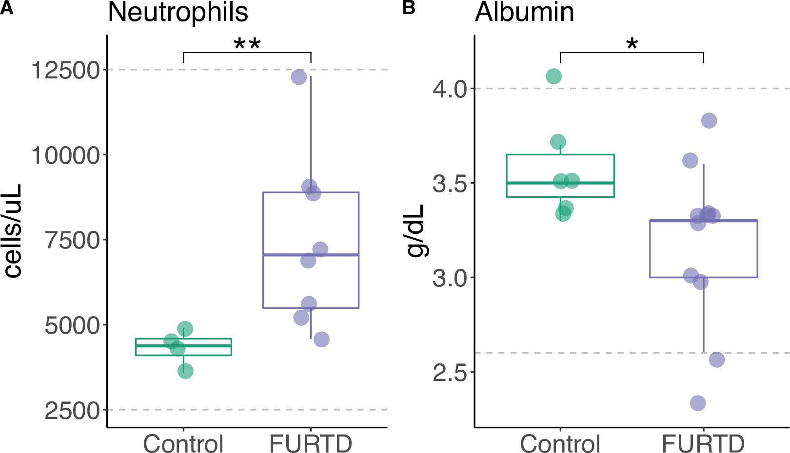
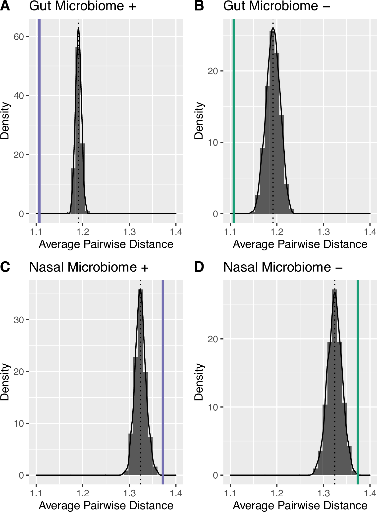
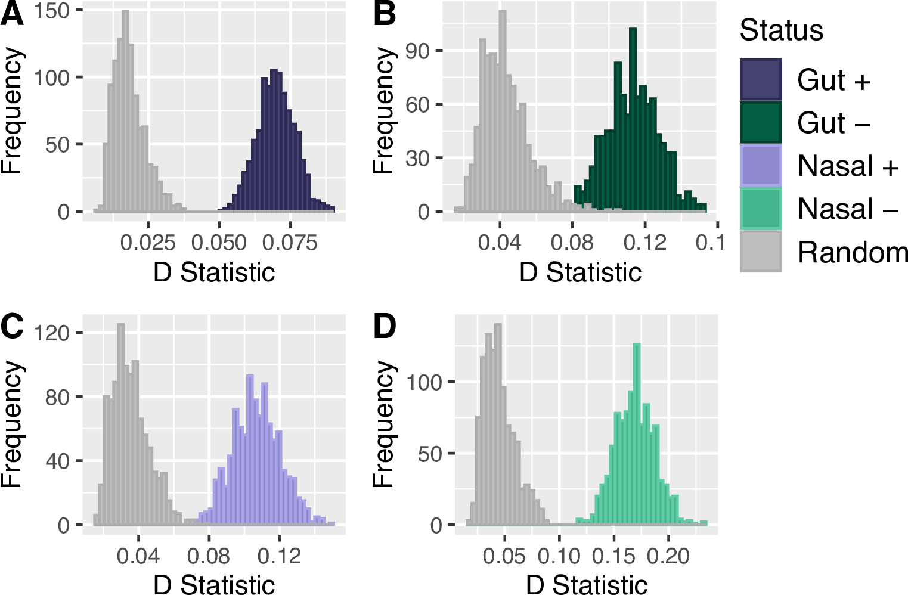
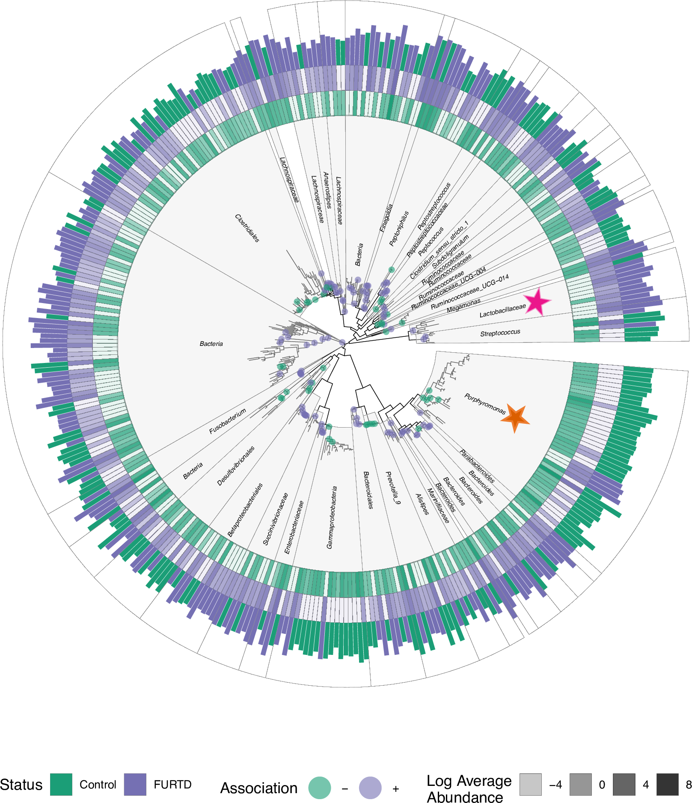
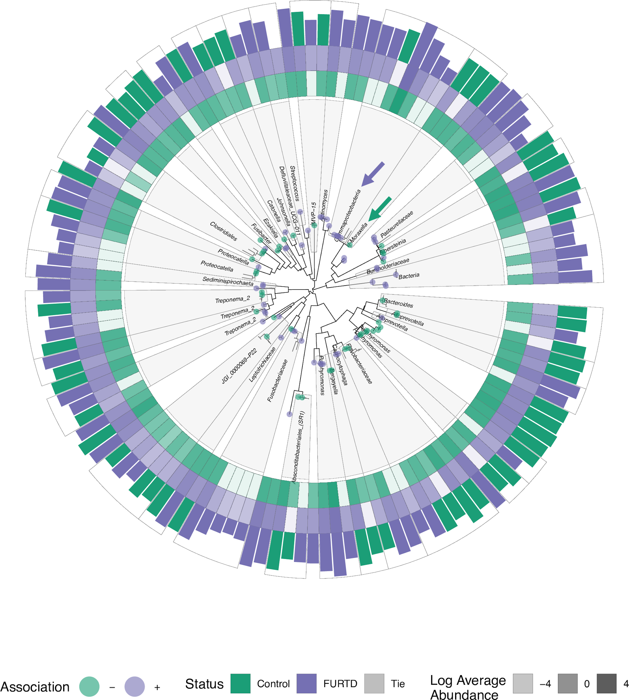
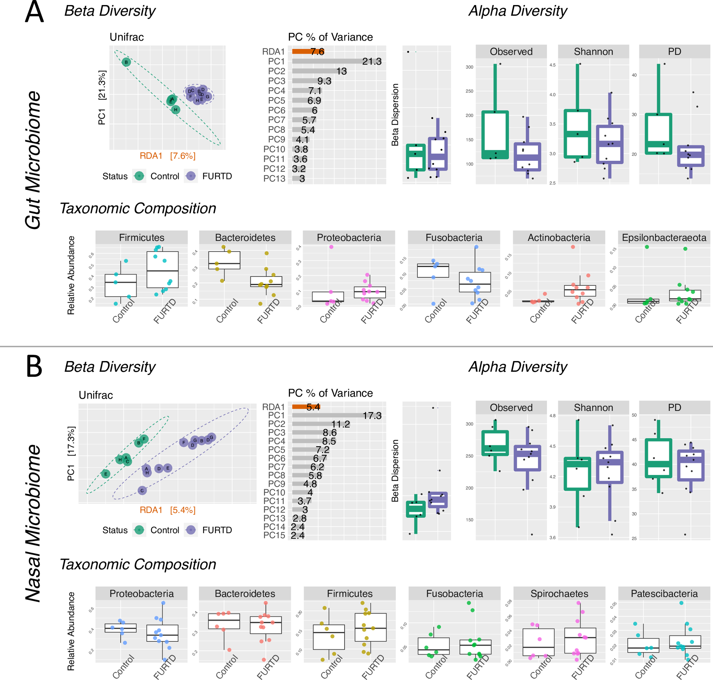
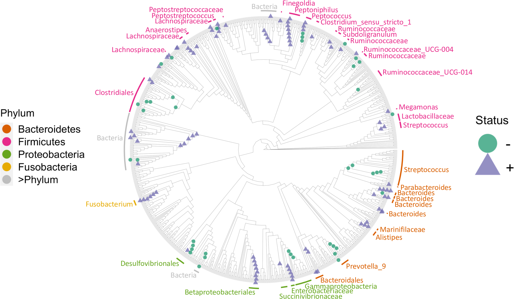
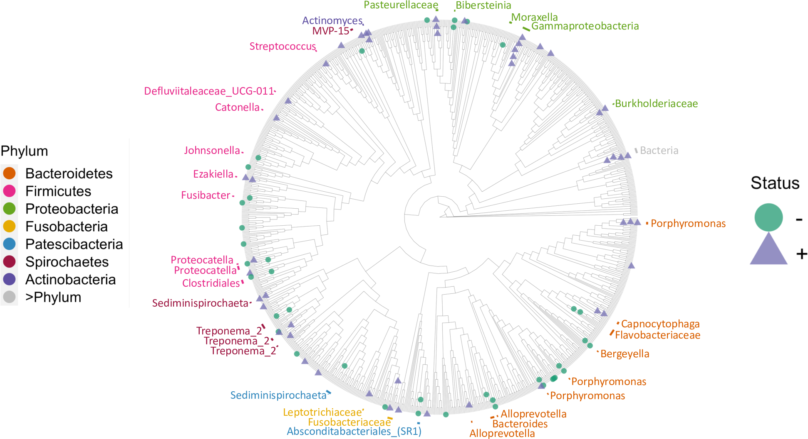

README
================
Holly Arnold
9/21/2022

## Chronic clinical signs of upper respiratory tract disease associate with gut and respiratory microbiomes in a cohort of domestic felines

Feline upper respiratory tract disease (FURTD), often caused by
infections etiologies, is a multifactorial syndrome affecting feline
populations worldwide. Because of its highly transmissible nature,
infectious FURTD is most prevalent anywhere cats are housed in groups
such as animal shelters, and is associated with negative consequences
such as decreasing adoption rates, intensifying care costs, and
increasing euthanasia rates. Understanding the etiology and
pathophysiology of FURTD is thus essential to best mitigate the negative
consequences of this disease. Clinical signs of FURTD include acute
respiratory disease, with a small fraction of cats developing chronic
sequelae. It is thought that nasal mucosal microbiome changes play an
active role in the development of acute clinical signs, but it remains
unknown if the microbiome may play a role in the development and
progression of chronic clinical disease. To address the knowledge gap
surrounding how microbiomes link to chronic FURTD, we asked if microbial
community structure of upper respiratory and gut microbiomes differed
between cats with chronic FURTD signs and clinically normal cats. We
selected 8 households with at least one cat exhibiting chronic clinical
FURTD, and simultaneously collected samples from cohabitating clinically
normal cats. Microbial community structure was assessed via 16S rDNA
sequencing of both gut and nasal microbiome communities. Using a
previously described ecophylogenetic method, we identified 37 and 27
microbial lineages within gut and nasal microbiomes respectively that
significantly associated with presence of active FURTD clinical signs in
cats with a history of chronic signs. Overall, we find that nasal and
gut microbial communities may contribute to the development of chronic
clinical course, but more research is needed to confirm our
observations.

# Markers suggestive of underlying inflammation differ in cats with and without clinical signs of chronic FURTD

Although cell counts were within normal reference ranges for all cats,
the number of neutrophils per microliter of whole blood was
significantly increased in the FURTD group compared to controls (Figure
1A), consistent with an inflammatory response in the FURTD group
(Wilcoxon Rank Sum Test; W = 31; p = 0.01). We also found that albumin
levels were significantly lower in FURTD cats compared to controls (W =
11; p = 0.03), consistent with the expected negative protein acute phase
protein response (Figure 1B).

 Figure 1: Markers suggestive of
inflammation correlate with FURTD status. Absolute number of neutrophils
(1A) and albumin (1B) levels are displayed for cases and controls. Box
plots summarize the median, lower quartile, and upper quartile for each
value. Laboratory reference ranges for neutrophil numbers and albumin
levels are bounded by grey dashed lines. Significance values are
indicated by an asterisk.

# Gut microbiome features show evidence of phylogenetic dispersion while nasal microbiome features show evidence of phylogenetic over-dispersion

 Figure 2: Gut microbiome features
significantly associated with clinical signs show evidence of
phylogenetic clustering while nasal microbiome features show evidence of
phylogenetic dispersion. Microbial features that were significantly
associated with clinical signs were separated into four groups: gut
microbiome features that positively (Figure 2A) or negatively (Figure
2B) associated with clinical signs, and nasal microbiome features that
positively (Figure 2C) or negatively (Figure 2D) associated with
clinical signs. For each figure, the observed average pairwise distance
is indicated by a vertical line (green or purple). The null expectation
of the average pairwise distance between two random nodes observed on
the phylogenetic tree is indicated by the black dotted vertical line.
The average pairwise distance generated under null expectation was
generated from a bootstrapped set of random samplings of phylogenetic
distances (N = 1000) and is indicated by the gray bars. Figure 2A:
Observed mean (μ\_(gut+)=1.10; σ\_(gut+)=0.43) was significantly
different compared to null expectation (〖z-score〗*(gut+)=-13.4;
p*(gut+)≪0.001). Figure 2B: Observed mean (μ\_(gut-)=1.11,
σ\_(gut-)=0.43) was significantly different compared to null expectation
(〖z-score〗*(gut-)=-5.7; p*(gut-)≪0.001). Figure 2C: Observed mean
(μ\_(nasal+)=1.37; σ\_(nasal+)=0.40) was significantly different
compared to null expectation (〖z-score〗*(nasal+)=4.1;
p*(nasal+)≪0.001). Figure 2D: Observed mean (μ\_(nasal-)=1.37;
σ\_(nasal-)=0.48) was significantly different compared to null
expectation (〖z-score〗*(nasal-)=3.2; p*(nasal-)&lt; 0.001).

# Gut and nasl microbiome features have significantly different pairwise distance distribution compared to null expectation.

 Figure 3: Gut and nasl microbiome
features have significantly different pairwise distance distribution
compared to null expectation. Microbial features that were significantly
associated with clinical signs were separated into four groups: gut
microbiome features that positively (5A) or negatively (5B) associated
with clinical signs, and nasal microbiome features that positively (5C)
or negatively (5D) associated with clinical signs. A D–statistic was
calculated by comparing the observed pairwise distances against a
permuted (N = 1000) random set of pairwise node distances for each group
A- D as indicated by the color legend (right). Null expectation is
indicated by grey bars. Figure 3A: D = 1; p &lt;&lt;0.001; Figure 3B: D
= 0.98; p &lt;&lt;0.001; Figure 3C: D = 0.99; p &lt;&lt; 0.001; Figure
3D: D = 1; p &lt;&lt; 0.001.

# Gut microbial features show conserved association patterns with host.

 Figure 4: Monophyletic lineages
within the gut microbiome reveal distinct cladal patterns of association
with clinical signs. Monophyletic lineages and ASVs significantly
associating with clinical signs were subset and displayed. Clade
taxonomic labels were assigned by determining the most specific Linnaean
taxonomic label that was shared by all cladal descendants. Significant
associations with FURTD or control individuals indicated with purple and
green points respectively. Tiles represent the log transformed average
abundances of each ASV in individuals without (green) and with (purple)
clinical signs. Bars along the outside of the figure represent the
higher average abundance of tiles for that ASV. Bars are color coded by
the group (case or FURTD) which had higher abundances. Orange and pink
stars are referred to as points of interest in text.

# Nasal microbial features show conserved association patterns with host.

 Figure 5: Monophyletic lineages
within the nasal microbiome reveal distinct cladal patterns of
association with clinical signs. Monophyletic lineages and ASVs within
the nasal microbiome significantly associating with clinical signs were
subset and visualized separately. Clade taxonomic labels were assigned
by determining the most specific Linnaean taxonomic label that was
shared by all cladal descendants. Significant associations with clinical
signs are indicated with stars. Tiles represent the log transformed
average abundances of each ASV in individuals without (green) and with
(purple) clinical signs. One lineage taxonomically annotated as
Moraxella has descending lineages which all show increased abundances in
cats with absent clinical signs (green arrow), while another clade
within Gammaproteobacteria contains six descending lineages of Moraxella
displaying association with presence of clinical signs (purple arrow).

# Microbial alpha and beta diversity community structure does not associate with clinical signs

S1 Figure: Gut and nasal microbiome community overview. Gut (S1A) and
nasal (S1B) microbiome communities. Each panel contains an overview of
alpha (right) and beta (left) diversity summaries (top rows) as well as
the relative abundances of the six most common phyla broken down by host
status (bottom rows). The presence (purple) or absence (green) of
clinical signs (host status) is noted by color for both beta and alpha
diversity plots.

Figure S1A: Diversity (top row) and taxonomic (bottom row) composition
summary of the gut microbiome. Gut Microbiome Beta Diversity (top left):
Redundancy analysis (RDA) plot derived from unweighted unique fraction
metric (UniFrac) constrained on host status (Unifrac; PERMANOVA; R2 =
0.07; p = 0.40). The percentage of variance explained by each PC is
displayed in descending order after the constrained axis (orange bar).
Host status explained 7.6% of variation within gut microbiome community
compositions. Beta dispersion was not significant between groups (F =
0.56; p = 0.50). Gut Microbiome Alpha Diversity (top right): Observed
Species Richness (Wilcoxon Rank Sum; W = 35; p = 0.25), Shannon’s
Diversity Index (Wilcoxon Rank Sum; W = 33; p = 0.37), and Phylogenetic
Alpha Diversity (Wilcoxon Rank Sum; W = 38; p = 0.13) was not
significant between groups.

Figure S1A Gut Microbiome Taxonomic Composition (bottom): The top six
most abundant phyla present across all individuals are displayed as
relative abundance box plots for control (left) and FURTD (right)
individuals. Wilcoxon Rank Sum tests for each pair was carried out and
then the resultant p-values were corrected for false discovery rate
(Bonferroni correction). No significant phyla level differences were
observed between cats with and without clinical signs after correction
for false discovery rate (q &gt; 0.05): Firmicutes (W = 36; p = 0.20; q
= 1.0), Bacteroidetes (W = 6; p = 0.023; q = 0.14); Proteobacteria (W =
34; p = 0.30; q = 1.0), Fusobacteria (W = 16; p = 0.30; q = 1);
Actinobacteria (W = 40; p = 0.08; q = 0.45); Epsilonbacteraeota (W = 29;
p = 0.67; q = 1.0).

Figure S1B: Diversity (top row) and taxonomic (bottom row) composition
summary of the nasal microbiome. Nasal Microbiome Beta Diversity: RDA
plot derived from unweighted UniFrac constrained on host status
(Unifrac; PERMANOVA; R2 = 0.06; p = 0.48). The percentage of variance
explained by each PC is displayed in descending order after the
constrained axis (orange bar). Host status 5.4% of variation within
nasal microbiome community compositions. Beta dispersion was not
significantly different between groups (F = 2.24; p = 0.14). Nasal
Microbiome Alpha Diversity: Observed Species Richness (Wilcoxon Rank
Sum; W = 45; p = 0.27), Shannon’s Diversity Index (Wilcoxon Rank Sum; W
= 31; p = 0.88), and Phylogenetic Alpha Diversity (Wilcoxon Rank Sum; W
= 36; p = 0.81) was not significant between groups.

Figure S1B Nasal Microbiome Taxonomic Composition: The top six most
abundant phyla present across all individuals are displayed as relative
abundance box plots for control (left) and FURTD (right) individuals.
Wilcoxon Rank Sum tests for each pair was carried out and then the
resultant p-values were corrected for false discovery rate (Bonferroni
correction). No significant phyla level differences were observed
between cats with and without clinical signs (q &gt; 0.05):
Proteobacteria (W = 26; p = 051; q = 1.0), Bacteroidetes (W = 27; p =
0.58; q = 1.0), Firmicutes (W = 40; p = 0.51; q = 1.0), Fusobacteria (W
= 34; p = 0.96; q = 1.0), Spirochaetes (W = 42; p = 0.39; q = 1.0), and
Patescibacteria (W = 40; p = 0.51; q = 1.0).

# Gut microbiota features significantly associate with the presence of clinical signs

S2 Figure: Gut microbiota features significantly associate with the
presence of clinical signs. Each microbial feature was modeled as a
function of clinical signs. Features of the gut microbiome which
significantly associated with the presence (purple) or absence (green)
of clinical signs are indicated by tree node color (fdr &lt; 0.05).
Phylogenetic tree labels indicate the significant microbial feature’s
phylum-level taxonomic label.

# Nasal microbiota features significantly associate with the presence of clinical signs

S3 Figure: Nasal microbiota features significantly associate with the
presence of clinical signs. Each microbial feature was modeled as a
function of clinical signs. Features of the nasal microbiome which
significantly associated with the presence (purple) or absence (green)
of clinical signs are indicated by tree node color (fdr &lt; 0.05).
Phylogenetic tree labels indicate the significant microbial feature’s
phylum-level taxonomic label.
