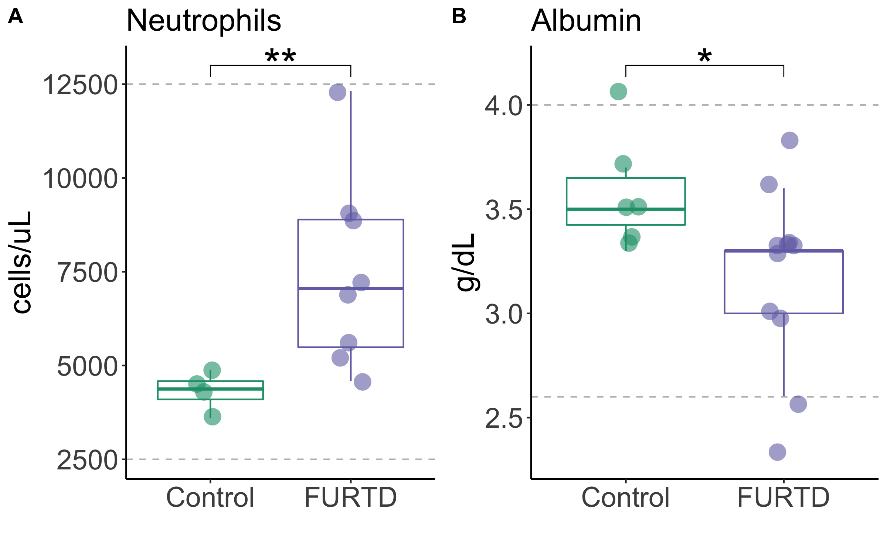

## Chronic clinical signs of upper respiratory tract disease associate with gut and respiratory microbiomes in a cohort of domestic felines 

Feline upper respiratory tract disease (FURTD), often caused by infections etiologies, is a multifactorial syndrome affecting feline populations worldwide. Because of its highly transmissible nature, infectious FURTD is most prevalent anywhere cats are housed in groups such as animal shelters, and is associated with negative consequences such as decreasing adoption rates, intensifying care costs, and increasing euthanasia rates. Understanding the etiology and pathophysiology of FURTD is thus essential to best mitigate the negative consequences of this disease. Clinical signs of FURTD include acute respiratory disease, with a small fraction of cats developing chronic sequelae. It is thought that nasal mucosal microbiome changes play an active role in the development of acute clinical signs, but it remains unknown if the microbiome may play a role in the development and progression of chronic clinical disease. To address the knowledge gap surrounding how microbiomes link to chronic FURTD, we asked if microbial community structure of upper respiratory and gut microbiomes differed between cats with chronic FURTD signs and clinically normal cats. We selected 8 households with at least one cat exhibiting chronic clinical FURTD, and simultaneously collected samples from cohabitating clinically normal cats. Microbial community structure was assessed via 16S rDNA sequencing of both gut and nasal microbiome communities. Using a previously described ecophylogenetic method, we identified 37 and 27 microbial lineages within gut and nasal microbiomes respectively that significantly associated with presence of active FURTD clinical signs in cats with a history of chronic signs. Overall, we find that nasal and gut microbial communities may contribute to the development of chronic clinical course, but more research is needed to confirm our observations. 

# Markers suggestive of underlying inflammation differ in cats with and without clinical signs of chronic FURTD

Although cell counts were within normal reference ranges for all cats, the number of neutrophils per microliter of whole blood was significantly increased in the FURTD group compared to controls (Figure 1A), consistent with an inflammatory response in the FURTD group (Wilcoxon Rank Sum Test; W = 31; p = 0.01). We also found that albumin levels were significantly lower in FURTD cats compared to controls (W = 11; p = 0.03), consistent with the expected negative protein acute phase protein response (Figure 1B). 

Figure 1: Markers suggestive of inflammation correlate with FURTD status. Absolute number of neutrophils (1A) and albumin (1B) levels are displayed for cases and controls. Box plots summarize the median, lower quartile and upper quartile for each value. Laboratory reference ranges for neutrophil numbers and albumin levels are bounded by grey dashed lines.

# Diversity Summary of Gut and Nasal Microbiome Communities

Overall gut and nasal microbial community structure does not significantly associate with the presence of clinical signs (Figure S1).

Figure S1A: Diversity (top row) and taxonomic (bottom row) composition summary of the gut microbiome. Gut Microbiome Beta Diversity (top left): Redundancy analysis (RDA) plot derived from unweighted unique fraction metric (UniFrac) constrained on host status (Unifrac; PERMANOVA; R2 = 0.07; p = 0.40). The percentage of variance explained by each PC is displayed in descending order after the constrained axis (orange bar). Host status explained 7.6% of variation within gut microbiome community compositions. Beta dispersion was not significant between groups  (F = 0.56; p = 0.50). Gut Microbiome Alpha Diversity (top right): Observed Species Richness (Wilcoxon Rank Sum; W = 35; p = 0.25), Shannon’s Diversity Index (Wilcoxon Rank Sum; W = 33; p = 0.37), and Phylogenetic Alpha Diversity (Wilcoxon Rank Sum; W = 38; p = 0.13) was not significant between groups. 

Figure S1A Gut Microbiome Taxonomic Composition (bottom): The top six most abundant phyla present across all individuals are displayed as relative abundance box plots for control (left) and FURTD (right) individuals. Wilcoxon Rank Sum tests for each pair was carried out and then the resultant p-values were corrected for false discovery rate (Bonferroni correction). No significant phyla level differences were observed between cats with and without clinical signs after correction for false discovery rate (q > 0.05): Firmicutes (W = 36; p = 0.20; q = 1.0), Bacteroidetes (W = 6; p = 0.023; q = 0.14); Proteobacteria (W = 34; p = 0.30; q = 1.0), Fusobacteria (W = 16; p = 0.30; q = 1); Actinobacteria (W = 40; p = 0.08; q = 0.45); Epsilonbacteraeota (W = 29; p = 0.67; q = 1.0). 

Figure S1B: Diversity (top row) and taxonomic (bottom row) composition summary of the nasal microbiome. Nasal Microbiome Beta Diversity: RDA plot derived from unweighted UniFrac constrained on host status (Unifrac; PERMANOVA; R2 = 0.06; p = 0.48). The percentage of variance explained by each PC is displayed in descending order after the constrained axis (orange bar). Host status 5.4% of variation within nasal microbiome community compositions. Beta dispersion was not significantly different between groups (F = 2.24; p = 0.14).  Nasal Microbiome Alpha Diversity: Observed Species Richness (Wilcoxon Rank Sum; W = 45; p = 0.27), Shannon’s Diversity Index (Wilcoxon Rank Sum; W = 31; p = 0.88), and Phylogenetic Alpha Diversity (Wilcoxon Rank Sum; W = 36; p = 0.81) was not significant between groups. 

Figure S1B Nasal Microbiome Taxonomic Composition: The top six most abundant phyla present across all individuals are displayed as relative abundance box plots for control (left) and FURTD (right) individuals. Wilcoxon Rank Sum tests for each pair was carried out and then the resultant p-values were corrected for false discovery rate (Bonferroni correction). No significant phyla level differences were observed between cats with and without clinical signs (q > 0.05): Proteobacteria (W = 26; p = 051; q = 1.0), Bacteroidetes (W = 27; p = 0.58; q = 1.0), Firmicutes (W = 40; p = 0.51; q = 1.0), Fusobacteria (W = 34; p = 0.96; q = 1.0), Spirochaetes (W = 42; p = 0.39; q = 1.0), and Patescibacteria (W = 40; p = 0.51; q = 1.0). 

